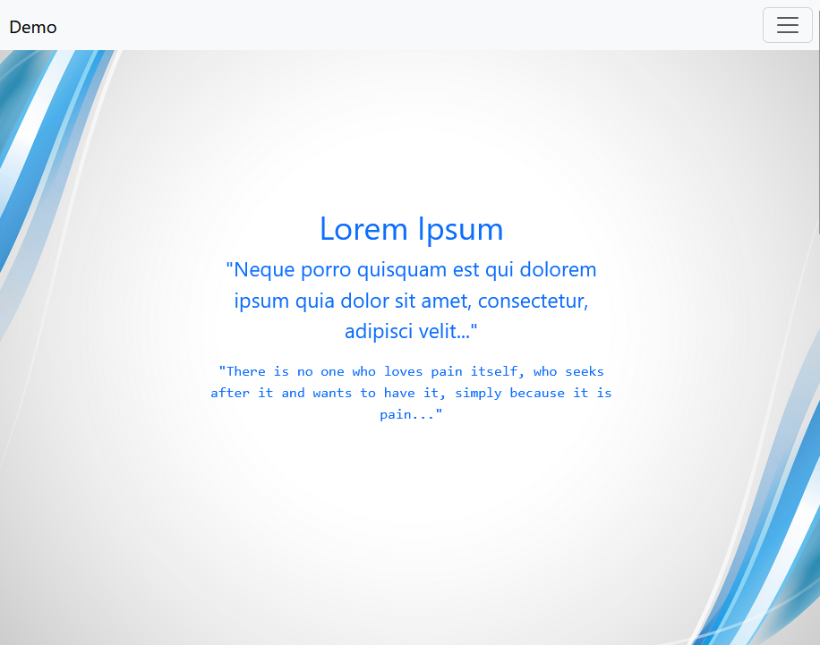

# Demo Page

a simple webpage with bootstrap, for building an action workflow on my server.


## Lokal Testen

1. Image bauen
```bash
docker build -t demo-page-image .
```
- `-t` demo-page → dein Image bekommt den Namen *demo-page*.
- `.` → aktuelles Verzeichnis als Build-Kontext.

2. Container starten
```bash
docker run -d --name demo-page-contianer -p 8008:80 demo-page-image
```
- `-d` → detached (läuft im Hintergrund).
- `-p 8080:80` → mappe lokalen Port 8080 auf Port 80 im Container (nginx).
- `--name mysite-container` → Container bekommt einen eindeutigen Namen.

3. Logs checken (falls was nicht geht)
```bash
docker logs demo-page-contianer
```

4. Browser
Browser öffnen mit [http://localhost:8008](http://localhost:8008) 
   

5. Container stoppen & löschen
```bash
docker stop demo-page-contianer
docker rm demo-page-contianer
```


